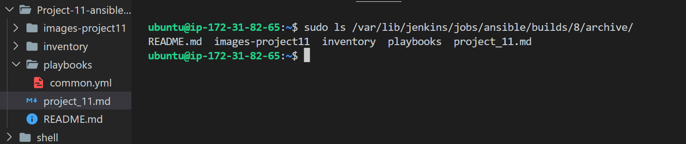

## **ANSIBLE CONFIGURATION MANAGEMENT – AUTOMATE PROJECT 7 TO 10**

</br>

### **INSTALL AND CONFIGURE ANSIBLE ON EC2 INSTANCE**
</br>

Update Name tag on your Jenkins EC2 Instance to `Jenkins-Ansible`. We will use this server to run playbooks.

In your GitHub account create a new repository and name it `ansible-config-mgt`.

**Instal Ansible**

        sudo apt update

        sudo apt install ansible

Check your Ansible version by running

         ansible --version


**Configure Jenkins build job to save your repository content every time you change it** 

Create a new Freestyle project `ansible` in Jenkins and point it to your `‘ansible-config-mgt’` repository.

`Configure Webhook` in GitHub and set webhook to trigger ansible build.

`Configure a Post-build` job to save all `(**)` files, like we did it in Project 9.

</br>


Test the setup by making some change in README.MD file in master branch and make sure that builds starts automatically and Jenkins saves the files (build artifacts) in following folder

`ls /var/lib/jenkins/jobs/ansible/builds/<build_number>/archive/`


Note: Trigger Jenkins project execution only for /main (master) branch.

Now your setup will look like this:


</br>

### **Step 2 – Prepare your development environment using Visual Studio Code**

1. First part of ‘DevOps’ is ‘Dev’, which means you will require to write some codes and you shall have proper tools that will make your coding and debugging comfortable – you need an Integrated development environment (IDE) or Source-code Editor. There is a plethora of different IDEs and Source-code Editors for different languages with their own advantages and drawbacks, you can choose whichever you are comfortable with, but we recommend one free and universal editor that will fully satisfy your needs – Visual Studio Code (VSC), you can get it here.

2. After you have successfully installed VSC, configure it to connect to your newly created GitHub repository.


3. install `remote developpement pack`

</br>


4. Clone down your ansible-config-mgt repo to your Jenkins-Ansible instance

`git clone <ansible-config-mgt repo link>`

</br>

### **step-3 BEGIN ANSIBLE DEVELOPMENT**

1. In your `ansible-config-mgt` GitHub repository, create a `new branch` that will be used for development of a new feature.

`git branch ansible-play`

view all branches

`git branch`


Tip: Give your branches descriptive and comprehensive names, for example, if you use Jira or Trello as a project management tool – include ticket number (e.g. PRJ-145) in the name of your branch and add a topic and a brief description what this branch is about – a bugfix, hotfix, feature, release (e.g. feature/prj-145-lvm)

2. Checkout the newly created feature branch to your local machine and start building your code and directory structure

`git checkout ansible-play`

`git branch`


3. Create a directory and name it `playbooks` – it will be used to store all your playbook files.
`
mkdir playbooks`

4. Create a directory and name it `inventory` – it will be used to keep your hosts organised.
   
`mkdir inventory`

1. Within the `playbooks folder`, create your first playbook, and name it `common.yml`
   
        cd playbooks
        touch common.yml
   
2. Within the inventory folder, create an inventory file (.yml) for each environment (Development, Staging Testing and Production) dev, staging, uat, and prod respectively.

        cd inventory

        touch dev.yml staging.yml uat.yml prod.yml

### **Step 4 – Set up an Ansible Inventory**

</br>

An Ansible inventory file `defines the hosts` and `groups of hosts` upon which `commands, modules, and tasks` in a playbook operate. 

Since our intention is to execute Linux commands on remote hosts, and ensure that it is the intended configuration on a particular server that occurs. It is important to have a way to organize our hosts in such an Inventory.

Save below inventory structure in the `inventory/dev` file to start configuring your development servers. Ensure to replace the `IP addresses` according to your own setup.

Note: Ansible uses `TCP port 22` by default, which means it needs to ssh into target servers from `Jenkins-Ansible host` – for this you can implement the concept of `ssh-agent`. Now you need to `import your key` into `ssh-agent`:

Add key

        eval `ssh-agent -s`
        ssh-add <path-to-private-key>


Confirm the key has been added with the command below, you should see the name of your key

        ssh-add -l

Now, ssh into your Jenkins-Ansible server using ssh-agent

`ssh -A ubuntu@public-ip`

ssh -A ubuntu@44.201.102.225


Also notice, that your `Load Balancer` user is `ubuntu` and user for `RHEL-based servers` is `ec2-user`.

Update your inventory/dev.yml file with this snippet of code:

```py
[nfs]
<NFS-Server-Private-IP-Address> ansible_ssh_user='ec2-user'

[webservers]
<Web-Server1-Private-IP-Address> ansible_ssh_user='ec2-user'
<Web-Server2-Private-IP-Address> ansible_ssh_user='ec2-user'

[db]
<Database-Private-IP-Address> ansible_ssh_user='ec2-user' 

[lb]
<Load-Balancer-Private-IP-Address> ansible_ssh_user='ubuntu'

```

### **Step-5 CREATE A COMMON PLAYBOOK**

</br>

In `common.yml` playbook you will write configuration for `repeatable, re-usable, and multi-machine tasks` that is common to systems within the infrastructure.

Update your `playbooks/common.yml` file with following code:

```yml
---
- name: update web, nfs and db servers
  hosts: webservers, nfs, db
  remote_user: ec2-user
  become: yes
  become_user: root
  tasks:
    - name: ensure wireshark is at the latest version
      yum:
        name: wireshark
        state: latest

- name: update LB server
  hosts: lb
  remote_user: ubuntu
  become: yes
  become_user: root
  tasks:
    - name: Update apt repo
      apt: 
        update_cache: yes

    - name: ensure wireshark is at the latest version
      apt:
        name: wireshark
        state: latest
```

This playbook is divided into two parts, each of them is intended to perform the same task: install `wireshark` utility (or make sure it is updated to the latest version) on your `RHEL 8` and `Ubuntu` servers. It uses `root` user to perform this task and respective package manager: `yum` for `RHEL 8` and `apt` for `Ubuntu`.

update this playbook with following tasks:

- Create a directory and a file inside it
- Change timezone on all servers
- Run some shell script
- …
    


``` yml   
---
- name: update web, and nfs servers
  hosts: webservers, nfs, 
  remote_user: ec2-user
  become: yes
  become_user: root
  tasks:
    - name: ensure wireshark is at the latest version
      yum:
        name: wireshark
        state: latest

- name: update LB and db server
  hosts: lb, db
  remote_user: ubuntu
  become: yes
  become_user: root
  tasks:
    - name: Update apt repo
      apt: 
        update_cache: yes

    - name: ensure wireshark is at the latest version
      apt:
        name: wireshark
        state: latest

        - name: create a diretory , a file and set timezone on all servers 
  hosts: webservers, nfs, lb, db
  become: yes
  tasks:
    - name: create a directory
      file:
        path: /home/sample-directory
        state: directory

- name: create a file
  hosts: webservers, nfs, lb, db
  become: yes
  tasks:
    - name: create a file
      file:
        path: /home/sample-directory/ansible.txt
        state: touch

    - name: set timezone
      timezone:
        name: Africa/Lagos
``` 
      

        


### **Step 6 – Update GIT with the latest code**

Now you have a separate branch, you will need to know how to `raise a Pull Request (PR)`, get your `branch peer reviewed` and `merged` to the `master branch`.

Commit your code into GitHub:

1. use git commands to add, commit and push your branch to GitHub.

```
git status

git add <selected files>

git commit -m "commit message"
```
To push the command to our branch:

`git push origin ansible-play`


2. Create a Pull request (PR)

3. Wear a hat of another developer for a second, and act as a reviewer.

4. If the reviewer is happy with your new feature development, merge the code to the master branch.

5. Head back on your terminal, checkout from the feature branch into the master, and pull down the latest changes.

`git switch main`

`git pull ansible-play`

`git merge ansible-play`

Once your code changes appear in master branch – Jenkins will do its job and save all the files (build artifacts) to `/var/lib/jenkins/jobs/ansible/builds/<build_number>/archive/` directory on `Jenkins-Ansible server`.

`sudo ls /var/lib/jenkins/jobs/ansible/builds/8/archive/`



### **Step 7 – Run first Ansible test**

Now, it is time to `execute ansible-playbook` command and verify if your playbook actually works:

add ssh configuration in remote developpent

```py
Hostjenkins-ansible
    HostName <host public ip>
    User ubuntu
    IdentityFile <path-to-pem-key>
    ForwardAgent yes
    ControlPath /temp/ansible-ssh-%h-%p-%r
    ControlMaster auto
    ControlPersist 10m
```

```py
Hostjenkins-ansible
    HostName 35.173.244.101
    User ubuntu
    IdentityFile C:/Users/bbbil/Downloads/sclient.pem
    ForwardAgent yes
    ControlPath /temp/ansible-ssh-%h-%p-%r
    ControlMaster auto
    ControlPersist 10m
```


- ssh into jenkins-ansible server

      ssh -A user-name@<jenkinkins-ansible-public-ip>

`ssh -A ubuntu@35.168.133.79`

`cd /var/lib/jenkins/jobs/ansible/builds/<build_number>/archive`

Run

`ansible-playbook -i inventory/dev.yml playbooks/common.yml`


</br>
cdwireshark has been installed by running which wireshark or wireshark --version

</br>


The updated with Ansible architecture now looks like this:


